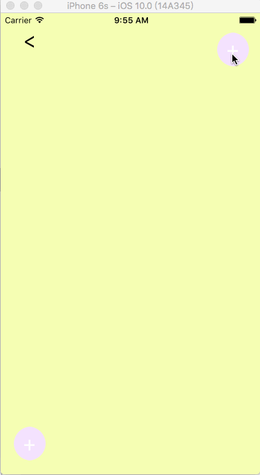
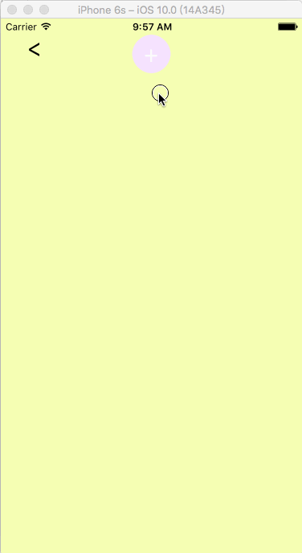
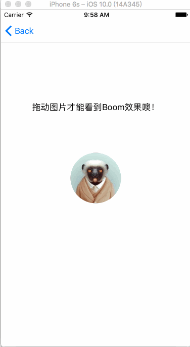
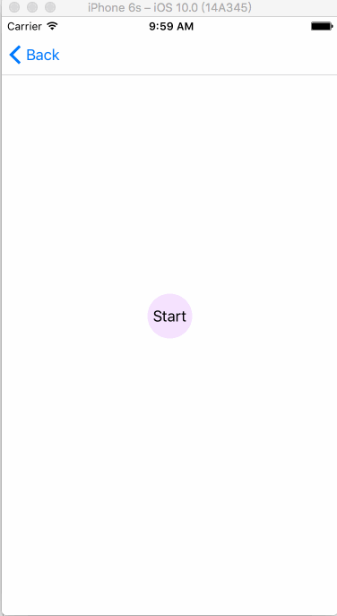

# Animation

本类库是学习模仿网上看到的有意思的动画

## Ping Transition
#### 动画效果

#### 说明
自定义的push专场动画，可以根据按钮的位置自动调整展开方向
#### 原理
* ViewController类实现`UINavigationControllerDelegate`协议，协议方法中返回自定义的实现了`UIViewControllerAnimatedTransitioning`协议的专场动画类和返场动画类
* 动画效果的具体实现见代码

## Present Transition
#### 动画效果

#### 说明
自定义的present专场动画
#### 原理
* ViewController类实现`UIViewControllerTransitioningDelegate`协议，协议方法中返回自定义的实现了`UIViewControllerAnimatedTransitioning`协议的专场动画类和返场动画类
* 动画效果的具体实现见代码

## Boom Animation
#### 动画效果

#### 说明
爆炸动画，通过扩展UIView实现，可以应用于任何UIView及其子类

## Bubble Shake Animation
#### 动画效果

#### 说明
模拟泡泡在空中飘动的动画，通过扩展UIView实现，可以应用于任何UIView及其子类